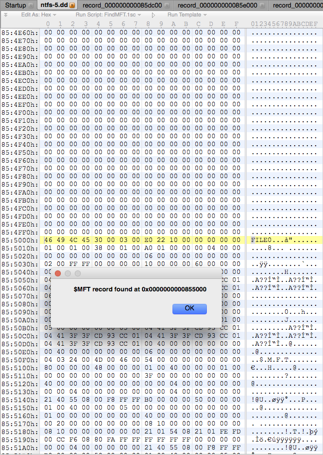

# NTFS Hound #

[TOC]

## What is it? ##

NTFS Hound is a collection of tools that facilitate forensic analysis of NTFS volumes. Specifically, NTFS Hound features:

* ```dump_offsets.c```, a small C program to quickly find MFS records from the NTFS volume
* ```FindMFT.1sc```, a script for [010 Editor](http://www.sweetscape.com/010editor/) to find the $MFT record in an NTFS partition dump
* ```MFTRecord.bt```, a template for 010 Editor to facilitate the analysis of an MFT record. The record has to be saved as a separate file on disk (see below for instructions and screenshots)

These tools have been developed for the COMP40750 - Corporate investigation course of the [M.Sc. in Digital Investigations and Forensic Computing](https://www.cs.ucd.ie/PostgraduateProgrammes/MSc_DIFC/) at [UCD University College Dublin](https://www.ucd.ie/). This is a companion tool of [mergelogs](https://bitbucket.org/insomniacslk/mergelogs) developed for the same course.

Like the ```mergelogs``` project, this has been developed in a short time frame and is not meant to be a production-ready tool, so please be kind when judging the code :)

## Compatibility ##

* ```dump_offsets``` runs on any POSIX system with a C compiler (e.g. gcc or clang). It has been developed on Linux and tested on OS X. Never tried on Windows, let me know if you do :)
* ```FindMFT.1sc`` and ```MFTRecord.bt``` require [010 Editor](http://www.sweetscape.com/010editor/), which runs on Linux, OS X and Windows.

## How to use it ##

### dump_offsets ###

Compile it:

```bash
cc -o dump_offsets -Wall -Werror -ansi -std=c89 dump_offsets.c
```

The same instructions are available in the source code.

Run it:

```bash
./dump_offsets <path/to/image.dd>
```

Replace <path/to/image.dd> with the path to your image dump.

It will scan the image and print information on the MFT record. For example:

```
insomniac:ntfs-hound insomniac$ ./dump_offsets images/usbdrive/ntfs-5.dd
0) Possible record found at 0x0000000000454c00 (id = 11 , name = $Extend, type = file, in use = yes)
1) Possible record found at 0x0000000000455c00 (id = 11 , name = $Extend, type = file, in use = yes)
2) Possible record found at 0x0000000000456c00 (id = 11 , name = $Extend, type = file, in use = yes)
3) Possible record found at 0x000000000045c800 (id = 4294967194 , name = (null), type = file, in use = no)
4) Possible record found at 0x000000000045e800 (id = 4294967247 , name = (null), type = file, in use = no)
5) Possible record found at 0x0000000000855000 (id = 0 , name = $MFT, type = file, in use = yes)
6) Possible record found at 0x0000000000855400 (id = 1 , name = $MFTMirr, type = file, in use = yes)
7) Possible record found at 0x0000000000855800 (id = 2 , name = $LogFile, type = file, in use = yes)
8) Possible record found at 0x0000000000855c00 (id = 3 , name = $Volume, type = file, in use = yes)
9) Possible record found at 0x0000000000856000 (id = 4 , name = $AttrDef, type = file, in use = yes)
10) Possible record found at 0x0000000000856400 (id = 5 , name = ., type = directory, in use = yes)
11) Possible record found at 0x0000000000856800 (id = 6 , name = $Bitmap, type = file, in use = yes)
12) Possible record found at 0x0000000000856c00 (id = 7 , name = $Boot, type = file, in use = yes)
13) Possible record found at 0x0000000000857000 (id = 8 , name = $BadClus, type = file, in use = yes)
14) Possible record found at 0x0000000000857400 (id = 9 , name = $Secure, type = file, in use = yes)
15) Possible record found at 0x0000000000857800 (id = 10 , name = $UpCase, type = file, in use = yes)
16) Possible record found at 0x0000000000857c00 (id = 11 , name = $Extend, type = directory, in use = yes)
...
40) Possible record found at 0x000000000085dc00 (id = 35 , name = text2.txt, type = file, in use = yes)
41) Possible record found at 0x000000000085e000 (id = 36 , name = text1.txt, type = file, in use = yes)
...
258) Possible record found at 0x0000000000894400 (id = 4294967293 , name = (null), type = file, in use = no)
259) Possible record found at 0x0000000000894800 (id = 4294967294 , name = (null), type = file, in use = no)
260) Possible record found at 0x0000000000894c00 (id = 4294967295 , name = (null), type = file, in use = no)
```

To print all the special MFT records, you can filter the output with ```grep```:

```
insomniac:ntfs-hound insomniac$ ./dump_offsets images/usbdrive/ntfs-5.dd | grep 'name = \$'
0) Possible record found at 0x0000000000454c00 (id = 11 , name = $Extend, type = file, in use = yes)
1) Possible record found at 0x0000000000455c00 (id = 11 , name = $Extend, type = file, in use = yes)
2) Possible record found at 0x0000000000456c00 (id = 11 , name = $Extend, type = file, in use = yes)
5) Possible record found at 0x0000000000855000 (id = 0 , name = $MFT, type = file, in use = yes)
6) Possible record found at 0x0000000000855400 (id = 1 , name = $MFTMirr, type = file, in use = yes)
7) Possible record found at 0x0000000000855800 (id = 2 , name = $LogFile, type = file, in use = yes)
8) Possible record found at 0x0000000000855c00 (id = 3 , name = $Volume, type = file, in use = yes)
9) Possible record found at 0x0000000000856000 (id = 4 , name = $AttrDef, type = file, in use = yes)
11) Possible record found at 0x0000000000856800 (id = 6 , name = $Bitmap, type = file, in use = yes)
12) Possible record found at 0x0000000000856c00 (id = 7 , name = $Boot, type = file, in use = yes)
13) Possible record found at 0x0000000000857000 (id = 8 , name = $BadClus, type = file, in use = yes)
14) Possible record found at 0x0000000000857400 (id = 9 , name = $Secure, type = file, in use = yes)
15) Possible record found at 0x0000000000857800 (id = 10 , name = $UpCase, type = file, in use = yes)
16) Possible record found at 0x0000000000857c00 (id = 11 , name = $Extend, type = directory, in use = yes)
29) Possible record found at 0x000000000085b000 (id = 24 , name = $Quota, type = file, in use = yes)
30) Possible record found at 0x000000000085b400 (id = 25 , name = $ObjId, type = file, in use = yes)
31) Possible record found at 0x000000000085b800 (id = 26 , name = $Reparse, type = file, in use = yes)
32) Possible record found at 0x000000000085bc00 (id = 27 , name = $RmMetadata, type = directory, in use = yes)
33) Possible record found at 0x000000000085c000 (id = 28 , name = $Repair, type = file, in use = yes)
34) Possible record found at 0x000000000085c400 (id = 29 , name = $TxfLog, type = directory, in use = yes)
35) Possible record found at 0x000000000085c800 (id = 30 , name = $Txf, type = directory, in use = yes)
36) Possible record found at 0x000000000085cc00 (id = 31 , name = $Tops, type = file, in use = yes)
37) Possible record found at 0x000000000085d000 (id = 32 , name = $TxfLog.blf, type = file, in use = yes)
38) Possible record found at 0x000000000085d400 (id = 33 , name = $TXFLO~1, type = file, in use = yes)
39) Possible record found at 0x000000000085d800 (id = 34 , name = $TXFLO~2, type = file, in use = yes)
```

To print all the regular files and directories:

```
insomniac:ntfs-hound insomniac$ ./dump_offsets images/usbdrive/ntfs-5.dd | grep -E 'name = [^(null)|^\$].*in use = yes'
10) Possible record found at 0x0000000000856400 (id = 5 , name = ., type = directory, in use = yes)
40) Possible record found at 0x000000000085dc00 (id = 35 , name = text2.txt, type = file, in use = yes)
41) Possible record found at 0x000000000085e000 (id = 36 , name = text1.txt, type = file, in use = yes)
```

This means that the tool has found a directory (".", the root directory of the NTFS volume) and two files, "text1.txt" and "text2.txt".

These files can be further analysed with 010 Editor using the script and the template created for this. See next section.


To extract all the records, create a subdirectory named ```dump``` and use ```--dump```:

```
insomniac:ntfs-hound insomniac$ ./dump_offsets images/usbdrive/ntfs-5.dd --dump
...
```

All the records will be saved under ```dump``` with names like ```record_XXXXXXXX``` where XXXXXXXX is the hexadecimal offset from the start of the file. This will be useful when using MFTRecord.bt described below.


### FindMFT.1sc ###

This script runs on an open NTFS volume dump (e.g. ```ntfs-5.dd``` in the previous examples) and, once invoked, will search for the $MFT record. The search is done by scanning the volume, since the assignment assumes that the boot record has been overwritten.

Open 010 Editor, add the script using the menu Scripts -> Edit Scripts List, click on New and then point the path to ```FindMFT.1sc``` . This has to be done only once.

To run the script, press F7 or go to Scripts -> Run Script and select FindMFT. If the MFT is found, you will get a message box with the offset to the MFT record. The record is always 1024 bytes long and starts with the string "FILE".

 


In order to analyse a record with the template shown below, you have to select the 1024-bytes block. To do this, select it with the mouse and stop when the value Size on the status bar on the bottom right reaches 1024. Then right-click on the selection and save the selection to a file.
If you have used ```dump_records``` with the option ```--dump```, you have already all the records extracted under ```dump```.

### MFTRecord.bt ###

This template runs on an extracted record (see above to learn how to do that), and will show all the information about the MFT record.

Imagine that you want to analyse the $MFT record found above. We know it is at the address 0x0000000000855000 , so let's open the file ```dump/record_0000000000855000``` with 010 Editor.

Now add the template to the templates list, very similarly to how we made for the script.

To do this, go to the menu Templates -> Edit Templates List, click on New and then point the path to ```MFTRecord.bt```. This has to be done only once.

To run the template, press F5 or go to Templates -> Run Template and select MFTRecord. If the MFT record is valid, the template will show you all of its fields in the central pane.

 Screenshot goes here

Expand the various fields, and you will see that you can click on any field and see the corresponding bytes on the pane above, and the meaning on the central pane. Just explore it and enjoy :)

## Contact me ##

My name is Andrea Barberio, you can find my contacts at https://insomniac.slackware.it .
